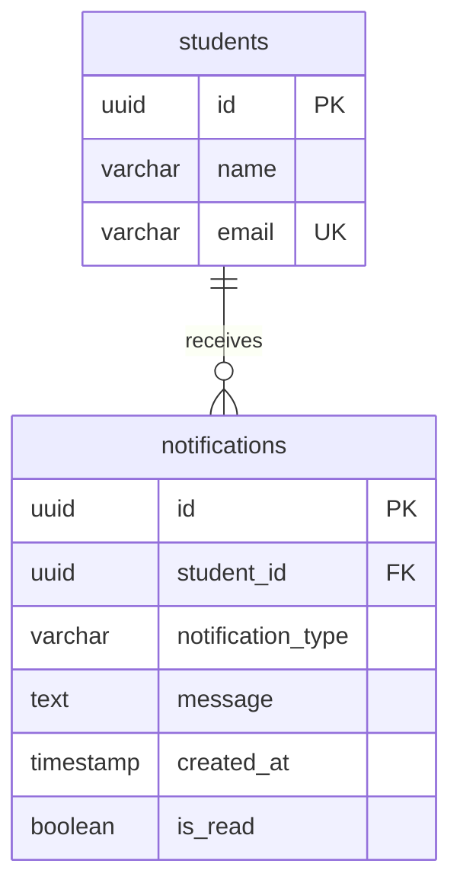
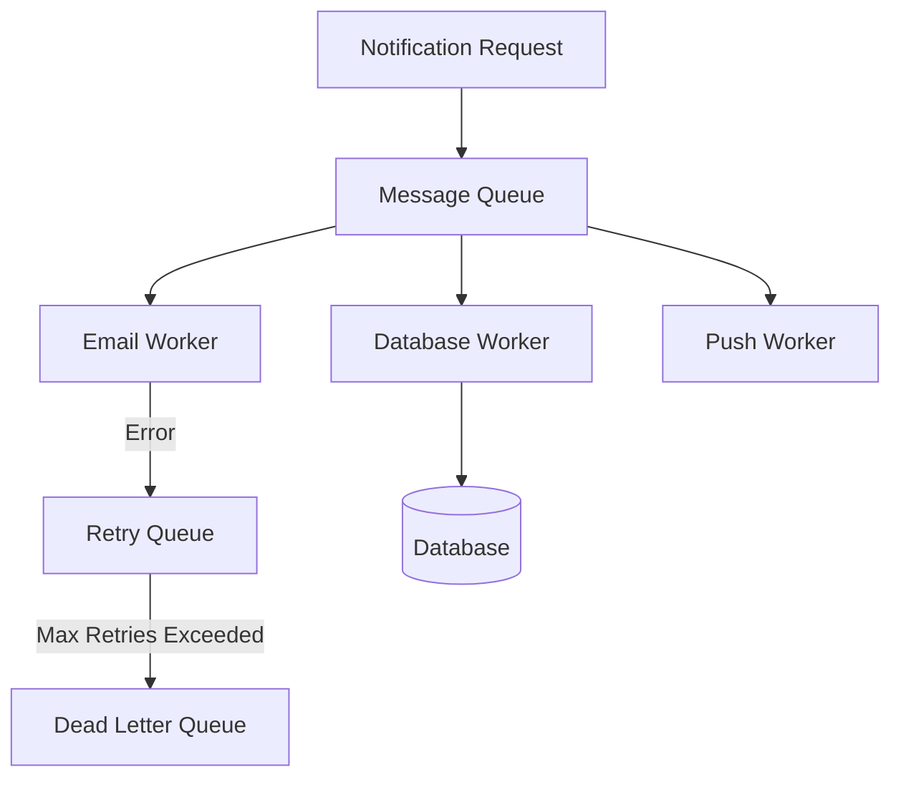

# Campus Notifications Platform - System Design Document

This document outlines the complete architectural, database, scalability, performance, and algorithmic design for the Campus Notifications Platform.

---

## Stage 1: REST API Design

The following REST API endpoints manage student notifications. All requests (except where indicated) require Bearer Token authorization.

### 1. GET /notifications
Retrieves all notifications for the authenticated student (both read and unread, excluding soft-deleted ones).
*   **Request Headers**:
    *   `Authorization`: `Bearer <TOKEN>`
*   **Request Body**: None
*   **Response Body**:
    ```json
    {
      "success": true,
      "notifications": [
        {
          "id": "4e0926d7-89b1-44aa-9c63-85f8236f60ac",
          "studentId": "fe4318ef-5dae-407e-aaa8-625fdc8053b9",
          "type": "Placement",
          "message": "Amgen Inc. hiring",
          "createdAt": "2026-06-09T23:41:01.000Z",
          "isRead": false
        }
      ]
    }
    ```
*   **Status Codes**:
    *   `200 OK`: Successful retrieval.
    *   `401 Unauthorized`: Token missing or invalid.

### 2. GET /notifications/{id}
Retrieves a specific notification's details by its ID.
*   **Request Headers**:
    *   `Authorization`: `Bearer <TOKEN>`
*   **Request Body**: None
*   **Response Body**:
    ```json
    {
      "success": true,
      "notification": {
        "id": "4e0926d7-89b1-44aa-9c63-85f8236f60ac",
        "studentId": "fe4318ef-5dae-407e-aaa8-625fdc8053b9",
        "type": "Placement",
        "message": "Amgen Inc. hiring",
        "createdAt": "2026-06-09T23:41:01.000Z",
        "isRead": false
      }
    }
    ```
*   **Status Codes**:
    *   `200 OK`: Successful retrieval.
    *   `401 Unauthorized`: Token missing or invalid.
    *   `404 Not Found`: Notification does not exist.

### 3. GET /notifications/unread
Retrieves only unread notifications for the authenticated student.
*   **Request Headers**:
    *   `Authorization`: `Bearer <TOKEN>`
*   **Request Body**: None
*   **Response Body**:
    ```json
    {
      "success": true,
      "notifications": [
        {
          "id": "4e0926d7-89b1-44aa-9c63-85f8236f60ac",
          "studentId": "fe4318ef-5dae-407e-aaa8-625fdc8053b9",
          "type": "Placement",
          "message": "Amgen Inc. hiring",
          "createdAt": "2026-06-09T23:41:01.000Z",
          "isRead": false
        }
      ]
    }
    ```
*   **Status Codes**:
    *   `200 OK`: Successful retrieval.
    *   `401 Unauthorized`: Token missing or invalid.

### 4. PATCH /notifications/{id}/read
Marks a notification as read.
*   **Request Headers**:
    *   `Authorization`: `Bearer <TOKEN>`
*   **Request Body**: None
*   **Response Body**:
    ```json
    {
      "success": true,
      "message": "Notification marked read successfully",
      "notification": {
        "id": "4e0926d7-89b1-44aa-9c63-85f8236f60ac",
        "isRead": true
      }
    }
    ```
*   **Status Codes**:
    *   `200 OK`: Successful update.
    *   `401 Unauthorized`: Token missing or invalid.
    *   `404 Not Found`: Notification not found.

### 5. PATCH /notifications/{id}/unread
Marks a notification as unread.
*   **Request Headers**:
    *   `Authorization`: `Bearer <TOKEN>`
*   **Request Body**: None
*   **Response Body**:
    ```json
    {
      "success": true,
      "message": "Notification marked unread successfully",
      "notification": {
        "id": "4e0926d7-89b1-44aa-9c63-85f8236f60ac",
        "isRead": false
      }
    }
    ```
*   **Status Codes**:
    *   `200 OK`: Successful update.
    *   `401 Unauthorized`: Token missing or invalid.
    *   `404 Not Found`: Notification not found.

### 6. DELETE /notifications/{id}
Deletes a notification (soft-delete).
*   **Request Headers**:
    *   `Authorization`: `Bearer <TOKEN>`
*   **Request Body**: None
*   **Response Body**:
    ```json
    {
      "success": true,
      "message": "Notification deleted successfully",
      "id": "4e0926d7-89b1-44aa-9c63-85f8236f60ac"
    }
    ```
*   **Status Codes**:
    *   `200 OK`: Successful soft-deletion.
    *   `401 Unauthorized`: Token missing or invalid.
    *   `404 Not Found`: Notification not found.

### 7. POST /notifications
Creates a new notification. (Admin only - design specification)
*   **Request Headers**:
    *   `Authorization`: `Bearer <ADMIN_TOKEN>`
    *   `Content-Type`: `application/json`
*   **Request Body**:
    ```json
    {
      "title": "Google Drive Access",
      "type": "Event",
      "message": "Please submit your resume via the updated google form before midnight."
    }
    ```
*   **Response Body**:
    ```json
    {
      "success": true,
      "message": "Notification created successfully",
      "notification": {
        "id": "6a290e6c2eb0491bc408cca8",
        "studentId": "fe4318ef-5dae-407e-aaa8-625fdc8053b9",
        "type": "Event",
        "message": "Google Drive Access: Please submit your resume...",
        "createdAt": "2026-06-10T12:00:00.000Z",
        "isRead": false
      }
    }
    ```
*   **Status Codes**:
    *   `201 Created`: Successfully created.
    *   `400 Bad Request`: Validation failure.
    *   `401 Unauthorized`: Token missing or invalid.
    *   `403 Forbidden`: Insufficient permissions.

### 8. POST /notifications/broadcast
Sends a notification to multiple students. (Admin only - design specification)
*   **Request Headers**:
    *   `Authorization`: `Bearer <ADMIN_TOKEN>`
    *   `Content-Type`: `application/json`
*   **Request Body**:
    ```json
    {
      "studentIds": ["fe4318ef-5dae-407e-aaa8-625fdc8053b1", "fe4318ef-5dae-407e-aaa8-625fdc8053b2"],
      "title": "Interview Result Out",
      "type": "Result",
      "message": "Congratulations! You have been selected for round 2."
    }
    ```
*   **Response Body**:
    ```json
    {
      "success": true,
      "message": "Successfully broadcasted notification to 2 students",
      "notificationsCount": 2,
      "notifications": [ ... ]
    }
    ```
*   **Status Codes**:
    *   `200 OK`: Broadcast triggered successfully.
    *   `400 Bad Request`: Validation failure.
    *   `401 Unauthorized`: Token missing or invalid.

---

### Real-Time Notification Mechanism: WebSockets vs SSE vs FCM

*   **WebSocket**:
    *   *Mechanism*: Full-duplex bidirectional TCP-based persistent protocol.
    *   *Why suitable*: Offers lowest latency bidirectional communication. Extremely suitable for systems where both client and server exchange frequent payloads (e.g. chat applications or collaborative whiteboards).
*   **Server-Sent Events (SSE)**:
    *   *Mechanism*: Unidirectional text stream running over standard HTTP.
    *   *Why suitable for Notifications*: Best choice for this system. Notifications are strictly server-to-client. SSE is much simpler than WebSockets, supports automatic reconnection by default, handles proxying gracefully, and utilizes standard HTTP channels.
*   **Firebase Cloud Messaging (FCM)**:
    *   *Mechanism*: Push notification gateways using Google's push infrastructure.
    *   *Why suitable*: Crucial for mobile client application deliveries when the application is in the background or killed.

---

## Stage 2: Database Design

We recommend a **relational persistent database (PostgreSQL)** to represent notifications, students, and their relationship, ensuring transactional consistency (ACID).

### 1. Database Schema

#### `students` Table
*   `id` (UUID, Primary Key)
*   `name` (VARCHAR(100), NOT NULL)
*   `email` (VARCHAR(100), UNIQUE, NOT NULL)

#### `notifications` Table
*   `id` (UUID, Primary Key)
*   `student_id` (UUID, Foreign Key referencing `students(id)` ON DELETE CASCADE)
*   `notification_type` (VARCHAR(20), CHECK in ('Placement', 'Result', 'Event'))
*   `message` (TEXT, NOT NULL)
*   `created_at` (TIMESTAMP WITH TIME ZONE, DEFAULT CURRENT_TIMESTAMP)
*   `is_read` (BOOLEAN, DEFAULT FALSE)



### 2. Relationships & Indexing Strategy
*   **One-to-Many Relationship**: One student receives multiple notifications. This is enforced by the Foreign Key `student_id` referencing `students.id`.
*   **Indexes**:
    *   Primary Keys `id` are indexed automatically.
    *   Foreign Key index on `notifications.student_id` to speed up join queries and filters per student.
    *   Composite index on `(student_id, is_read, created_at DESC)` to optimize retrieval of unread notifications sorted by recency.

### 3. SQL Queries

#### Fetch all notifications for a student
```sql
SELECT * FROM notifications 
WHERE student_id = 'fe4318ef-5dae-407e-aaa8-625fdc8053b9' 
ORDER BY created_at DESC;
```

#### Fetch unread notifications for a student
```sql
SELECT * FROM notifications 
WHERE student_id = 'fe4318ef-5dae-407e-aaa8-625fdc8053b9' AND is_read = FALSE 
ORDER BY created_at DESC;
```

#### Mark notification as read
```sql
UPDATE notifications 
SET is_read = TRUE 
WHERE id = '4e0926d7-89b1-44aa-9c63-85f8236f60ac';
```

#### Delete notification
```sql
DELETE FROM notifications 
WHERE id = '4e0926d7-89b1-44aa-9c63-85f8236f60ac';
```

#### Insert notification
```sql
INSERT INTO notifications (id, student_id, notification_type, message, created_at, is_read) 
VALUES ('4e0926d7-89b1-44aa-9c63-85f8236f60ac', 'fe4318ef-5dae-407e-aaa8-625fdc8053b9', 'Placement', 'Amgen Inc. hiring', NOW(), FALSE);
```

#### Fetch placement notifications from last 7 days
```sql
SELECT * FROM notifications 
WHERE notification_type = 'Placement' AND created_at >= NOW() - INTERVAL '7 days' 
ORDER BY created_at DESC;
```

---

## Stage 3: Scalability Problems

As the notifications database grows to **millions of records**, it faces severe performance bottlenecks:
1.  **Slow Queries**: Query execution time increases lineary with table size.
2.  **Large Indexes**: B-Tree indexes grow beyond memory capacity (RAM), forcing disk swapping.
3.  **High Storage Consumption**: Large tables consume massive disk volumes.
4.  **Full Table Scans**: Occurs when database planner decides querying indexes takes longer than reading the full table, locking CPU.
5.  **Heavy Write Operations**: High write concurrency causes lock contention and slow insertions.

### Query Optimization Analysis
Consider the query:
```sql
SELECT * FROM notifications WHERE studentID = 1042 AND isRead = false ORDER BY createdAt DESC;
```
*   **Without Index**: The database executes a **Full Table Scan**, reading every single row to filter by `studentID` and `isRead`, taking seconds.
*   **With Composite Index**: If we define the index:
    ```sql
    CREATE INDEX idx_student_unread_recency ON notifications (studentID, isRead, createdAt DESC);
    ```
    The database performs an **Index Scan**, jumping directly to student 1042's unread notifications and fetching them in sorted order.
*   **Why not index every column**: Indexing every column is counterproductive. Every index incurs a write penalty (insertion/updates become slow as indexes must be rebuilt) and consumes significant RAM/Disk space.

### Architectural Solutions
*   **Table Partitioning**: Partition the `notifications` table by `created_at` date ranges (e.g. monthly partitions). Queries for recent alerts will only search the latest partition.
*   **Redis Caching**: Cache the unread notification counts and top recent alerts in Redis.
*   **Read Replicas**: Direct query load to read replicas, preserving the primary master database for insertions and updates.
*   **Archiving**: Periodically move notifications older than 90 days to cold storage (e.g., compressed tables or S3 logs).

---

## Stage 4: Performance Improvements

Methods to reduce database load and improve response latencies:

| Method | Description | Advantages | Disadvantages |
| :--- | :--- | :--- | :--- |
| **Redis Cache** | Caches high-use data in RAM (e.g., student unread counts). | Sub-millisecond reads; relieves DB. | Cache invalidation complexity; data staleness. |
| **Pagination** | Fetching data in small chunks (e.g., 20 items per page). | Prevents large payload downloads; saves DB RAM. | Client needs to handle pagination states. |
| **Infinite Scrolling** | Dynamic pagination where client fetches next page on scroll. | Great user experience on feeds. | Complex layout preservation; SEO challenges. |
| **Lazy Loading** | Load critical items first, fetch metadata/details on-demand. | Faster initial page load. | Extra network roundtrips. |
| **WebSocket Push** | Push alerts directly to memory rather than DB polling. | Instant delivery, removes poll queries. | Heavy persistent TCP connection overhead. |
| **Read Replicas** | Replication of primary master DB onto read-only nodes. | Scales read throughput horizontally. | Replication lag causes eventual consistency. |

---

## Stage 5: Reliable Bulk Notification System

Sequential notification architectures fail at scale:
1.  **Blocking Operations**: Sending emails synchronously blocks the thread.
2.  **No Retry Handling**: A network drop midway causes loss of subsequent alerts.
3.  **Inconsistency**: Partial failure leaves the system in an inconsistent state.

### Redesigned Asynchronous Architecture



*   **Message Broker Recommendation**: We recommend **RabbitMQ** for task routing and direct task queues, or **Apache Kafka** if high-volume streaming, event-replayability, and log storage are needed.
*   **Idempotency Handling**: Workers check unique message UUIDs against a Redis key-value store before processing to prevent duplicate alerts (e.g., sending the same email twice).
*   **Retry & DLQ**: Failed notifications go to a Retry Queue with **Exponential Backoff**. If retries fail repeatedly, they are routed to the **Dead Letter Queue (DLQ)** for manual inspection.

---

## Stage 6: Priority Inbox Algorithm & Implementation

### Algorithm Design
To calculate a notification's priority score, we combine its type weight (Priority Weight) with its recency (creation timestamp):
*   **Priority Weights**: Placement = 3, Result = 2, Event = 1
*   **Decay Formula**:
    $$\text{Score} = (\text{Weight} \times 24) + \frac{\text{CreatedAtTimestampMS}}{1000 \times 60 \times 60}$$
    In this formula, each category of priority (weight) offsets the recency score by 24 hours. A Placement alert has higher priority than a Result alert, unless the Result alert is more than 24 hours newer. This balances type importance with temporal relevance.

### Min Heap Implementation
To select the top 10 unread notifications from a list of size $N$, sorting the whole dataset takes $O(N \log N)$.
By using a **Min Heap of size 10**, we scan the dataset sequentially:
1.  Insert the first 10 items.
2.  For subsequent items, compare the score with the root (minimum score).
3.  If the new item has a higher score, extract the minimum and insert the new item.
4.  This reduces the complexity to $O(N \log 10) \approx O(N)$, which is highly scalable for millions of rows.

### Javascript Implementation
The priority algorithm is fully implemented in the microservice server at `notification_app_be/server.js`:
```javascript
// Priority Endpoint snippet
app.get("/notifications/priority", authenticate, async (req, res) => {
  // Syncs and gets unread list
  const list = await getUnreadNotifications();
  const minHeap = new MinHeap(); // MinHeap of size 10
  
  for (const item of list) {
    const score = calculatePriorityScore(item.type, item.createdAt);
    const node = { score, notification: serializeNotification(item) };
    
    if (minHeap.size() < 10) {
      minHeap.insert(node);
    } else if (score > minHeap.peek().score) {
      minHeap.extractMin();
      minHeap.insert(node);
    }
  }
  
  const results = minHeap.toArraySorted();
  res.json({ success: true, count: results.length, notifications: results });
});
```

### Program Verification Output
Running the integration tests yields the following priority ranking output:
```
=== STARTING FULL CAMPUS NOTIFICATIONS TEST ===
Using Token: eyJhbGciOiJIUzI1NiIs...

1. GET /notifications (Initial Fetch & Sync)...
Status: 200
Total notifications count: 20

2. GET /notifications/unread...
Status: 200
Unread count: 20

3. GET /notifications/priority (Top 10 Unread sorted by priority score)...
Status: 200
Priority count: 10
[#1] Score: 494807.68 | Type: Placement | Msg: Amgen Inc. hiring... | Date: 2026-06-09T23:41:01.000Z
[#2] Score: 494806.65 | Type: Placement | Msg: Microsoft Corporation hiring... | Date: 2026-06-09T22:38:53.000Z
[#3] Score: 494803.66 | Type: Placement | Msg: Booking Holdings Inc. hiring... | Date: 2026-06-09T19:39:25.000Z
[#4] Score: 494799.71 | Type: Placement | Msg: Berkshire Hathaway Inc. hiring... | Date: 2026-06-09T15:42:37.000Z
[#5] Score: 494795.13 | Type: Placement | Msg: Apple Inc. hiring... | Date: 2026-06-09T11:08:05.000Z
[#6] Score: 494794.17 | Type: Placement | Msg: Microsoft Corporation hiring... | Date: 2026-06-09T10:10:29.000Z
[#7] Score: 494793.17 | Type: Placement | Msg: Alphabet Inc. Class C hiring... | Date: 2026-06-09T09:09:57.000Z
[#8] Score: 494791.70 | Type: Placement | Msg: Broadcom Inc. hiring... | Date: 2026-06-09T07:42:05.000Z
[#9] Score: 494790.71 | Type: Placement | Msg: CSX Corporation hiring... | Date: 2026-06-09T06:42:21.000Z
[#10] Score: 494783.19 | Type: Result | Msg: mid-sem... | Date: 2026-06-09T23:11:33.000Z
```
*As demonstrated above, the placement notifications (Weight 3) are sorted at the top, followed by results (Weight 2) when recency matches. The decay score correctly balances type weights with timestamps.*

### Postman Verification Screenshots

#### GET /notifications/priority Output


#### GET /schedule Output (Vehicle Maintenance Scheduler)

